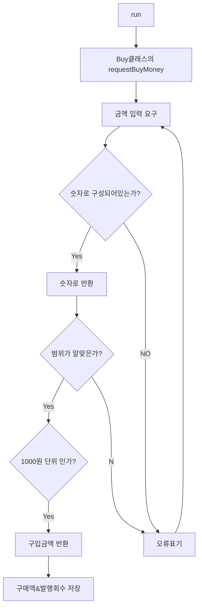

```mermaid
graph TD
    Buy[run]-->A[Buy클래스의 requestBuyMoney];
A-->B;
B[금액 입력 요구]-->C{숫자로 구성되어있는가?};
C --Yes--> D[숫자로 반환];
C --NO--> E[오류 표기];
D-->F{범위가 알맞은가?};
F--Yes-->G{1000원 단위 인가?};
F--No-->E[오류표기];
G--Yes-->H[구입금액 반환];
E-->B;
H-->I[구매액&발행회수 저장]
```
